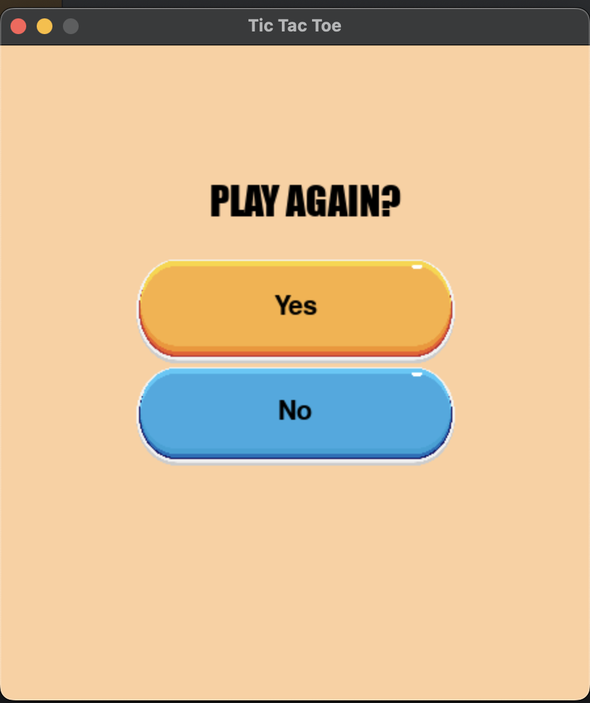
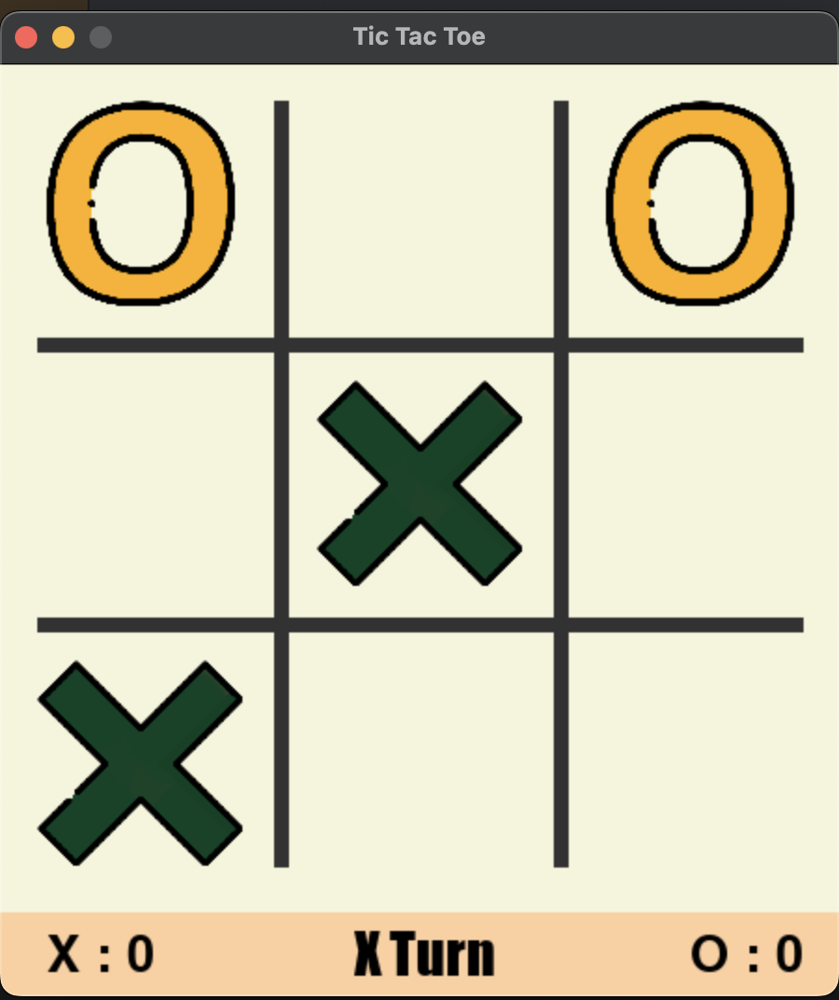
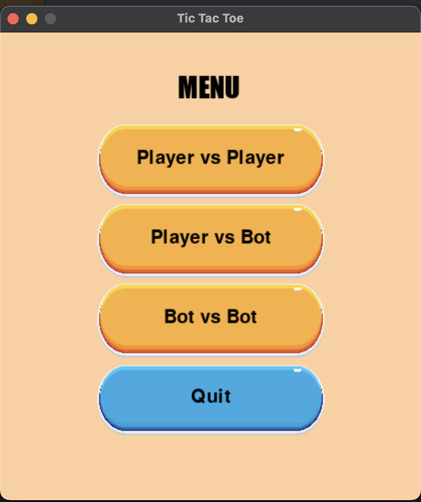
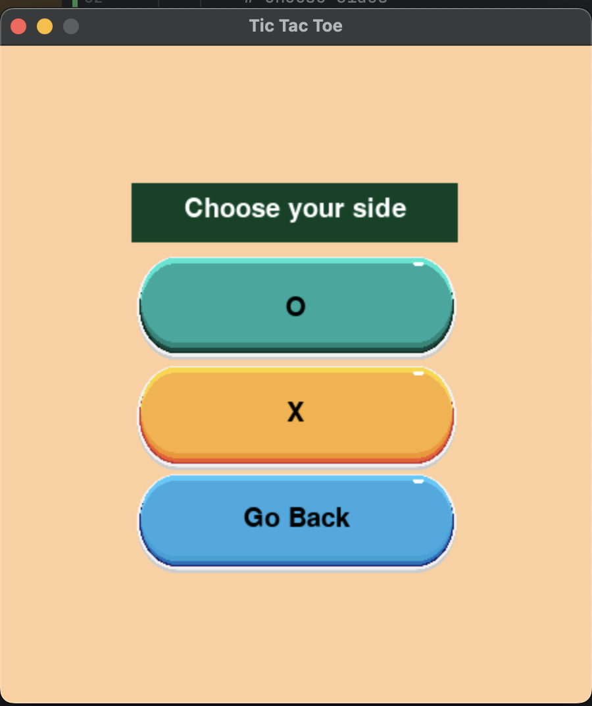

# Tic-Tac-Toe Game

A simple command-line implementation of the classic Tic-Tac-Toe game in Python using the Pygame library.

## Features

- Play against a friend in player vs player mode.
- Challenge the computer in player vs bot mode.
- Watch computer play against each other in bot vs bot mode
- Choose your side, X or O, in player vs player mode or player vs bot mode .
- Beautiful graphical interface using Pygame.
- A simple menu system to select game modes and restart the game.
- Option to quit the game at any time.
- A simple AI opponent for single-player mode.

## Getting Started

1. Clone this repository to your local machine:

   ```bash
   [git clone https://github.com/macbrina/tic-tac-toe.git](https://github.com/macbrina/TicTacToe.git)
   
2. Install the required dependencies
   
   ```bash
   pip install pygame

3. Run the game
   
   ```bash
   python main.py
   
4. Enjoy playing Tic-Tac-Toe!

# Game Controls

- Player 1 and Player 2 take turns clicking on empty cells to make their moves.
- In player vs bot mode, you play against the computer.
- Use the mouse to click on the cell where you want to place your symbol.
- Press the Space bar to pause and upause the game.

# Screenshots






# Contributing

Contributions are welcome! If you find any issues or have suggestions for improvements, please open an issue or create a pull request.

# License

This project is licensed under the [MIT License](LICENSE). See the [LICENSE](LICENSE) file for details.

# Acknowledgments

Thanks to the Pygame community for creating an excellent library for game development in Python.

